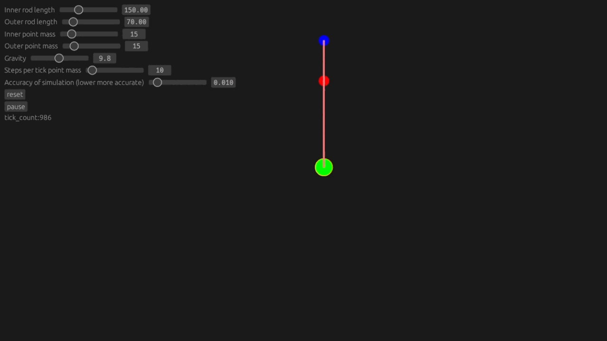

# About
I thought writing a double pendulum would be a fun way to practice writing guis, particularly egui.

So far egui wasn't the best choice as the image only updates when a mouse or keyboard input is sent.
I haven't found a way to around that so in the mean time I'm wiggling the mouse.


# How to run
With cargo installed this can be ran simply by running the following command from the base directory (The one with Cargo.toml).
``` bash
cargo run
```

# Scaling bars 


# Moving points




# Equations of motion
I used the equations of motion from this article
https://rjallain.medium.com/finding-the-equation-of-motion-for-a-double-pendulum-cff2635f99bd

$a=m_2 R_2$

$b=m_2 R_1$

$c=m_2 g$

$k=(m_1 + m_2) R1$

$f=(m_1 + m_2)g\$

$\ddot{\theta_1}=-\dfrac{a}{k}\ddot{\theta_2}\cos(\theta_1-\theta_2)-\dfrac{a}{k}\dot{\theta_2^2}\sin(\theta_1-\theta_2)-\dfrac{f}{k}\sin(\theta_1)$

$\ddot{\theta_2}=(\dfrac{1}{a-\dfrac{ba}{k}\cos^2(\theta_1 - \theta_2)})(\dfrac{ab}{k}\dot{\theta_2}\sin(\theta_1-\theta_2)\cos(\theta_1-\theta_2)+\dfrac{fb}{k}\sin(\theta_1)\cos(\theta_1-\theta_2)+b\dot{\theta_1^2}\sin(\theta_1-\theta_2)-c\sin(\theta_2))$


# Issues
- The simulation will update more frequently while user input is received
- I haven't graphed the potential energy vs kinetic energy yet so there may be an issue with my equations of motion
- If performance is an issue a good place to start looking is how often I change from polar to cartesian.
